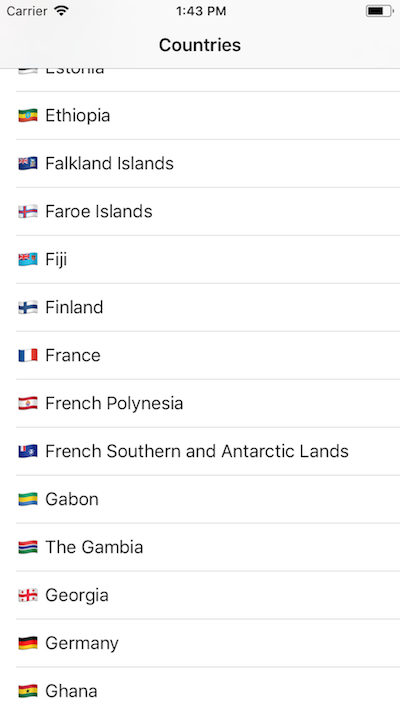

# Countries
Universal iOS app with individual country data




## Getting Started

Explore the countries of the world with Xcode or install the app on an iOS device

### Prerequisites

An iOS device 
```
An iOS device 
Developed with Swift 4.0
```
## Built With

* XCode Version 9.2 (9C40b)
* Developed with Swift 4.0

## Authors

* **Paul ReFalo**

## Acknowledgements

* Many thanks to everyone TekSystems and ebay for this opportunity

## License

This project open; no licensing
